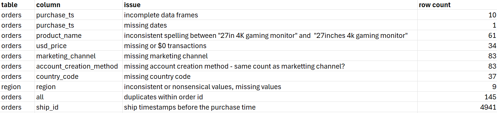
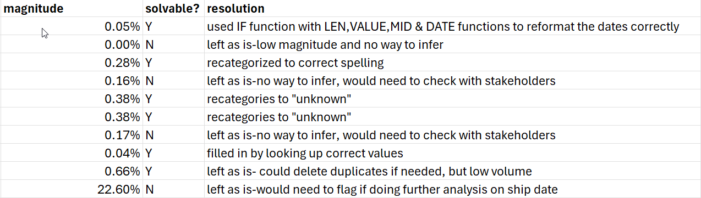

# Sales-Data-Cleaning-with-Excel

## Project Overview
-- This project demonstrates a professional data cleaning process applied to a real-world e-commerce dataset. Using a structured framework, raw sales data from "GameZone" was cleaned, documented, and prepared for analysis, transforming it into a reliable dataset for generating business insights.

**Tools Used**: Microsoft Excel

**Framework**: The CLEAN Method 
- Conceptualize, Locate, Evaluate, Augment, Note

---

MY Final Project is in  [Excel_data_cleaning](gamezone-data_cleaning.xlsx) 
- includes original dataset, cleaned data and issues log

---

## 🎯 Business Context
GameZone is a fictional e-commerce company (founded in 2018) that sells new and refurbished gaming products globally via its website and mobile app. This dataset contains approximately 20,000 sales records from various marketing channels.

**Objective**: Clean the dataset to answer key business questions about sales trends, regional performance, and customer acquisition effectiveness.

---

🔍 **Step 1: Conceptualize the Data**

*Grain*: Each row represents a unique customer order, identified by order_id.

**Key Metric**: usd_price (The value of each transaction).

**Key Dimensions**: purchase_timestamp, product_name, purchase_platform, marketing_channel, account_creation_method, country_code, region.

---

🧹 **Step 2 & 3: The Cleaning Process (Locate & Evaluate)**

-- An Issues Log was maintained throughout the process to prioritize and track all data quality issues.

A key deliverable of this project was maintaining a detailed issues log. Below is a summary:

 
 

The Issues Log was crucial for tracking decisions and maintaining transparency throughout the cleaning process.

**Why some issues were left unresolved:** As a best practice, data analysts avoid imputing values without a clear business logic or source of truth to prevent introducing bias into the dataset. Transparency over perfection is key.

---

✨ **Step 4: Data Augmentation**
To make the dataset more analytical, new columns were created:

*purchase_year & purchase_month*: Extracted from purchase_timestamp for trend analysis.

*time_to_ship_days*: Calculated the difference between ship_timestamp and purchase_timestamp. (Note: Contains negative values due to documented data issue).

*region*: Added by performing a lookup from the cleaned region table using the country_code.

---

📋 **Step 5: Note & Document**

All changes were made following best practices:

The original raw data was never modified. All cleaning was done in a separate worksheet.

New columns were created with a **_cleaned** suffix (e.g., product_name_cleaned) to preserve the original data.

All steps, decisions, and rationales are documented in this README and within the Excel file itself.

---

**📈 Insights & Next Steps**
This cleaned dataset is now ready for:

Exploratory Data Analysis (EDA) to uncover sales trends and customer behavior.

Building dashboards in Tableau/Power BI to visualize key performance indicators (KPIs).

Statistical analysis to understand the impact of marketing channels and product performance.

The clear documentation ensures that any analyst can understand the data's limitations and build upon this work.

---

**Conclusion**:
This project successfully transformed a raw, real-world sales dataset into a clean, reliable, and analysis-ready resource using Microsoft Excel. By applying the structured CLEAN framework, the process moved beyond simple error-fixing to encompass a professional workflow of conceptualization, issue resolution, and meticulous documentation.

The key takeaway is that effective data cleaning is not about achieving perfect data, but about achieving transparent and trustworthy data. By rigorously documenting every decision—especially the choice to leave certain unsolvable issues unaltered—this project demonstrates the critical thinking and integrity essential to a professional data analyst's role. The final dataset, now augmented with new dimensions and metrics, provides a robust foundation for generating actionable business insights and stands as a testament to a thorough, end-to-end data preparation process.

